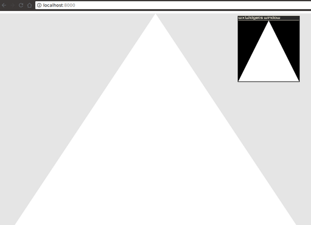

# wasm-wxwidgets-demo

Cross-platform GUI application using OpenGL to render the same graphic scene
on both native UI (wxWidgets) and web (WASM) frontends.

## Screenshot



## Requirements

1. Installed [emsdk](https://github.com/juj/emsdk) with [configured environment](https://kripken.github.io/emscripten-site/docs/getting_started/downloads.html).
2. wxWidgets and OpenGL libraries. For Debian 10 use following command to install:
```bash
apt install libwxgtk3.0-dev libglew-dev libgl1-mesa-dev
```
For Ubuntu 20.10, use the following command:
```bash
apt install libwxgtk3.0-gtk3-dev libglew-dev libgl1-mesa-dev
```

## Building and running

```bash
git clone https://github.com/jubnzv/wasm-wxwidgets-proof-of-concept example
pushd example/src/
make
popd
```

To run wx desktop application:
```bash
./src/wx
```

To run web frontend run:
```bash
cd static
python -m SimpleHTTPServer 8000
```

See result at http://localhost:8000/
